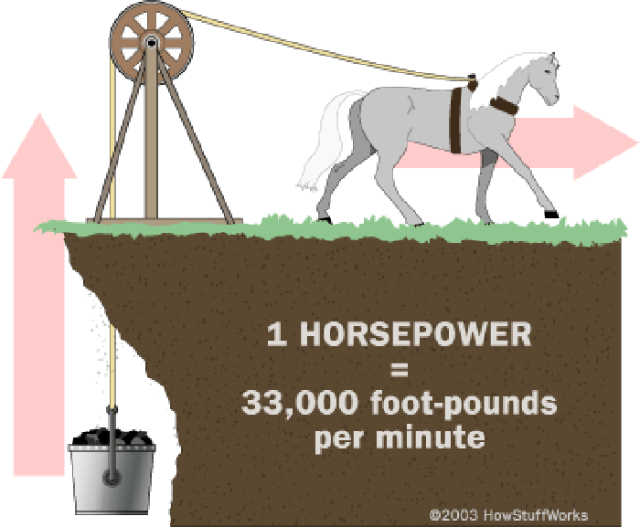
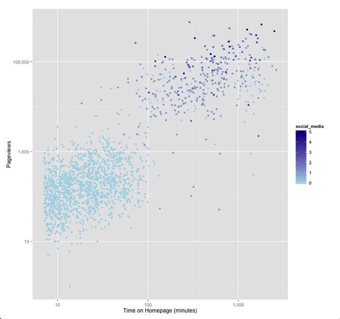
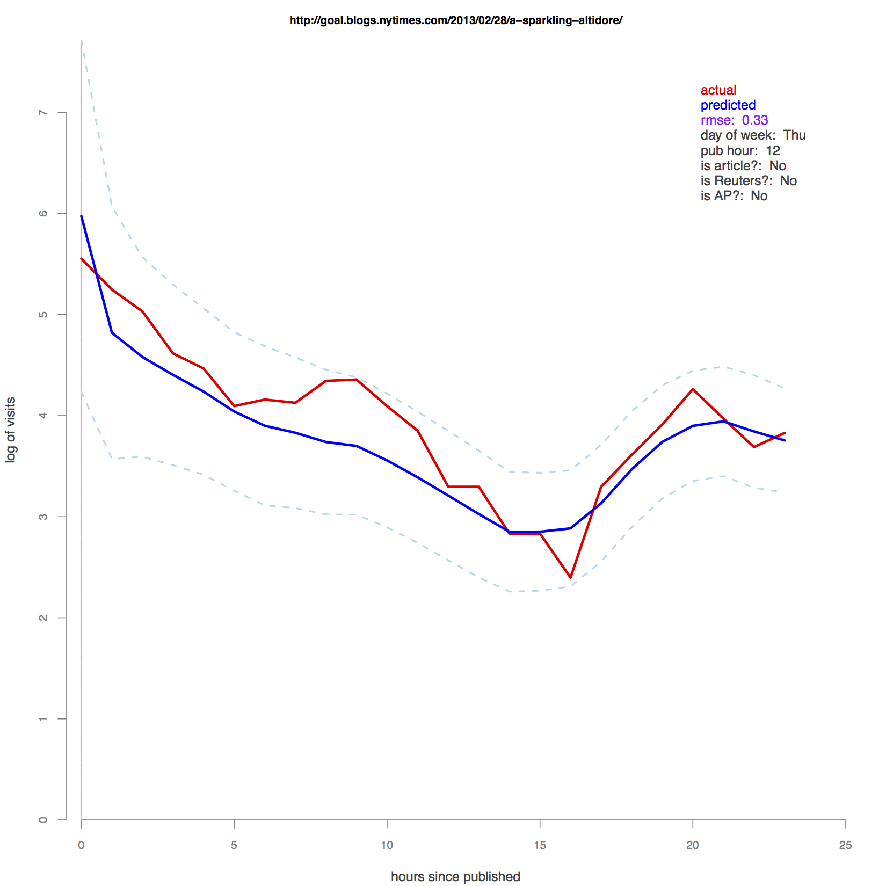

## Creating Metrics For News
Brian Abelson - @brianabelson  Mozilla-Knight OpenNews Fellow _New York Times_

### James Watt / Steam Engine

# 

### Horsepower
# 

### Horsepower now
# 

### What metrics are for and the effects they have.
* Metrics are for communicating complex concepts in interpretable, actionable terms
* As a given metric is codified, it comes to actively shape and define its context, often being manipulated in ways that lead to unforseen outcomes

### This guy
# 
_"What's an externality?"_

### What does this mean for News?
* Pageviews
  - Closely related to circulation size
  - Widely implemented and easy to measure
  - Of course, there have been many consequences:

# 

# 

### So how do we construct an alternative?
* A good metric should:  
  - Reflect an organization's well-defined goal(s).
  - Be widely applicable.
  - Provide actionable intellgence while remaining interpretable.
  - Minimize externalities.
  - Also, read: stdout.be/68

### Pageviews Above Replacement - PAR
1. Editors and Journalists constantly ask "How did it do"?
2. Raw numbers don't account for the promotion a story recieves.
3. By placing pageviews alongside promotional data (Twitter, Facebook, Homepage, Emails, etc), we can put these numbers in context, and make more meaningful comparisons

###### Promotion vs. Performance
# 

##### Predicting Pageviews
# 

### Potential externalities
* In my initial tests, "viral" articles rose to the top
* Optimizing for this metric may not necessarily reflect newsroom priorities

### In Conclusion:
* Metrics both reflect and shape the realities they attempt to capture.
* Building metrics for news requires that we think hard about what the potential side effects of their implementation.

### Thanks!
* @brianabelson
* brianabelson.com

